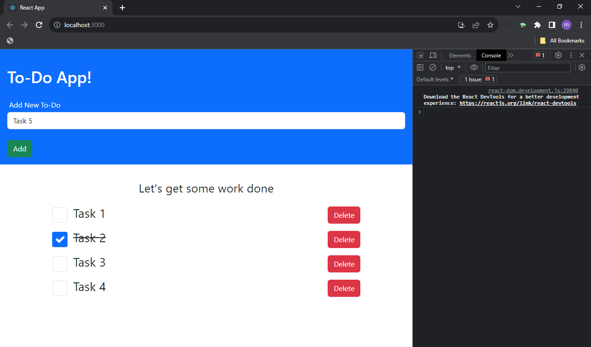

Creating a To-Do App with React Bootstrap

**To-Do Form with Required Input, Mark as Done, and Delete**



Welcome to our To-Do App built using React Bootstrap! This app allows you to create a to-do list with the following features:

1. **To-Do Form**: You can add tasks by entering them into the input field and clicking the "Add" button. The input field is required, and you cannot add empty tasks.

2. **Task List**: After adding a task, it will appear in a list below the form.

3. **Mark as Done**: You can mark tasks as done by clicking the "Mark as Done" button. This will add a strikethrough effect to the task text.

4. **Delete Task**: If you want to remove a task, simply click the "Delete" button, and it will be removed from the list.

### Getting Started

Follow these steps to set up and run the To-Do App on your machine:

1. **Clone the Repository**:

   ```bash
   git clone <repository-url>
   cd todo-app-react
   ```

2. **Install Dependencies**:

   ```bash
   npm install
   ```

3. **Start the App**:

   ```bash
   npm start
   ```

   This will launch the app in your web browser, and you can start using it.

### Project Structure

Here's an overview of the project structure:

- `src/components/ToDoForm.js`: This component represents the form for adding tasks. It includes a required input field and an "Add" button.

- `src/components/ToDoList.js`: This component displays the list of tasks. It includes "Mark as Done" and "Delete" buttons for each task.

- `src/App.js`: The main application component that manages the state of tasks and renders the form and task list components.

### Customization

Feel free to customize the app further to suit your needs. You can modify the styles, add additional features, or integrate with external APIs for more functionality.

Happy task management!